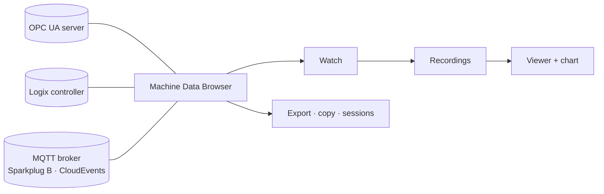

# Machine Data Browser (MachineDataBrowser)

[](https://github.com/ZaoralJ/MachineDataBrowser/actions/workflows/ci.yml)
[](LICENSE)


**Machine Data Browser** is a cross-platform viewer for machine data (.NET 10, Avalonia). It shows the data of one device at a time:

| Protocol | Endpoint | Highlights |
|---|---|---|
| **OPC UA** | `opc.tcp://host:4840` | secure endpoints, user login, custom structures, subscriptions |
| **EtherNet/IP** (Allen-Bradley Logix) | `eip://192.168.1.10/1,0` | controller and program tags, UDTs, arrays of UDTs |
| **MQTT** | `mqtt://broker[:port][/topic/#]`, `mqtts://`, `ws://`, `wss://` | topic tree, JSON fields, Sparkplug B, CloudEvents |

For any of these you can:

- browse the address space and read attributes,
- watch live values (stale and bad values stand out) and write new values,
- record values with limits, a schedule and live CSV files,
- look at recordings as a table with a trend chart,
- copy values as tables, JSON or C#, and save sessions.

Everything has a keyboard shortcut.



The app was called *OPC UA Browser* until version 0.8. Existing installs move over by themselves:
`brew upgrade` replaces the old cask (`opcua-browser`) and app, the first start copies the old data folder (settings,
certificates, layout, snapshots), and `.opcsession` files still open. OPC UA servers that trusted the app's client
certificate need to trust the new one (`MachineDataBrowser`) once.

## Install (macOS, Homebrew)

```sh
brew install --cask zaoralj/tap/machine-data-browser
```

The app is self-contained, so it needs no .NET installation. It is not notarized; if macOS blocks the first launch:

```sh
xattr -dr com.apple.quarantine "/Applications/Machine Data Browser.app"
```

Update with `brew upgrade --cask machine-data-browser`, remove with `brew uninstall --cask --zap machine-data-browser`.

## Try it with the test servers

```sh
just all     # Logix, OPC UA (two servers) and MQTT simulators in Docker
dotnet run --project src/MachineDataBrowser.App
```

Then connect to one of these:

- `opc.tcp://localhost:50000`
- `opc.tcp://localhost:4841/`
- `eip://localhost:44818/1,0`
- `mqtt://localhost:1883`

[docs/simulators.md](docs/simulators.md) describes what each simulator contains.

## Documentation

- [User manual](docs/user-manual.md): connecting, browsing, Watch, recordings, the chart, sessions, shortcuts,
  troubleshooting
- [Architecture](docs/architecture.md): projects, the protocol boundary, value flow, connection lifecycle, each
  protocol, the App, packaging (with diagrams)
- [Decisions](docs/decisions.md): why these libraries, how writing works per protocol, how MQTT and Sparkplug B are handled
- [Simulators](docs/simulators.md): local test servers and the integration tests

## Build and test

```sh
dotnet build                     # warnings are errors
dotnet test                      # unit + integration + headless UI tests (needs Docker)
dotnet run --project src/MachineDataBrowser.App
```

## Release

Releases are driven by [release-please](https://github.com/googleapis/release-please).

- Every merge to `main` updates a release PR. It bumps the version (from the Conventional Commit PR titles) and
  updates `CHANGELOG.md`.
- Merging that PR tags `vX.Y.Z`, creates the GitHub release and runs the `release` workflow. The workflow tests
  again, builds self-contained `osx-arm64`/`osx-x64` app bundles, attaches them and updates the Homebrew cask in
  `ZaoralJ/homebrew-tap`.

Pre-releases are tagged by hand and skip the tap: `scripts/release.sh 0.2.0-rc.1`.
Local package only: `packaging/macos/package.sh 0.2.0 arm64` → `artifacts/dist/`.

## Contributing

Contributions are welcome; see [CONTRIBUTING.md](CONTRIBUTING.md). Licensed under the [MIT License](LICENSE).
Third-party components are listed in [THIRD-PARTY-NOTICES.md](THIRD-PARTY-NOTICES.md).
