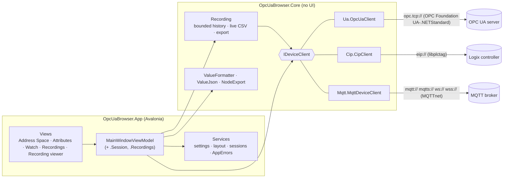
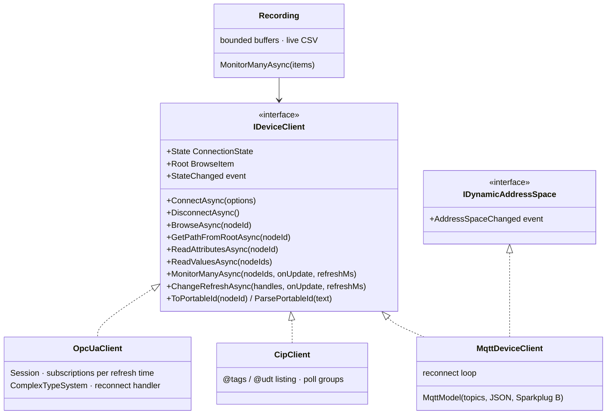
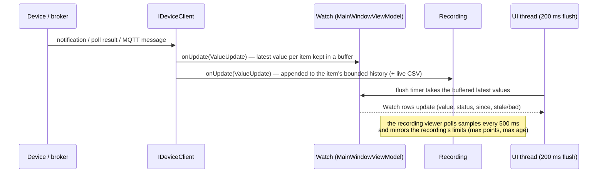
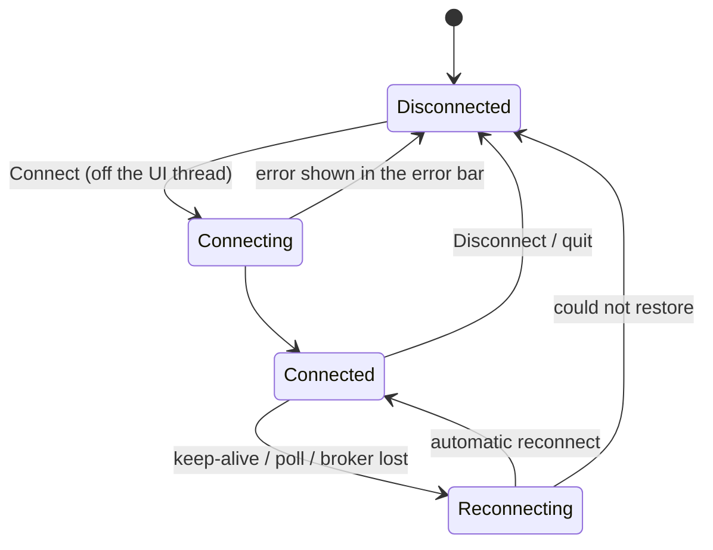
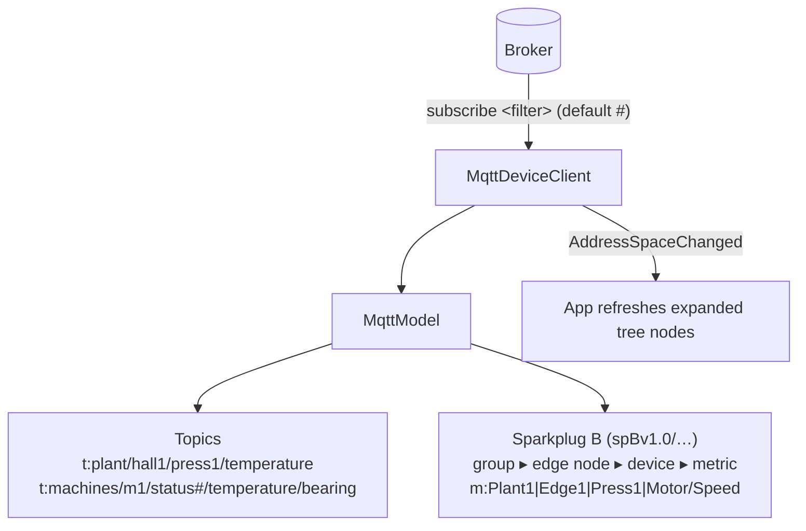

# Architecture

Machine Data Browser (repository `OpcUaBrowser`) is a machine data viewer. It connects to one device at a time:

- an OPC UA server,
- an Allen-Bradley Logix controller over EtherNet/IP (CIP), or
- an MQTT broker, including Sparkplug B.

Whichever device it is, you browse its address space, inspect attributes, watch live values, record them and export
them. It is read-only by design: it never writes to a device.

## Overview

| Project | Role |
|---|---|
| `src/OpcUaBrowser.Core` | Protocol clients, recordings, value formatting/JSON/C# export. No UI dependencies. |
| `src/OpcUaBrowser.App` | Avalonia 12 desktop app (MVVM with CommunityToolkit.Mvvm, docking with Dock.Avalonia). |
| `tests/OpcUaBrowser.Core.Tests` | Integration tests against containers (opc-plc and the `simulators/` images, via Testcontainers) plus unit tests. |
| `tests/OpcUaBrowser.App.Tests` | Headless Avalonia UI tests with real rendering (screenshots) against the same containers. |
| `simulators/` | Test servers for development and tests: Logix, opc-plc, OPC UA custom types, MQTT. See [simulators.md](simulators.md). |

The target is .NET 10. Package versions are pinned in `Directory.Packages.props`. Warnings are errors and the
recommended .NET analyzers are on.

## The protocol boundary: `IDeviceClient`

The OPC UA information model (`NodeId`, `NodeClass`, `StatusCode`, `Variant`) is the common vocabulary. Each
protocol maps its items onto it, so the tree, watch list, recordings, chart and exports work unchanged for every
protocol. `DeviceClient.Create(url)` picks the client from the URL scheme, so session files need no protocol field.

| | OPC UA (`opc.tcp://`) | EtherNet/IP (`eip://host[:port]/1,0`) | MQTT (`mqtt://host[:port][/filter]`) |
|---|---|---|---|
| Library | OPC Foundation UA-.NETStandard | libplctag.NET | MQTTnet |
| Tree | server address space (forward hierarchical references) | Controller tags / Programs ▸ tags ▸ UDT members, array elements | Topics (topic levels, JSON fields) and Sparkplug B (group ▸ edge node ▸ device ▸ metrics) |
| Node ids | `nsu=<namespace URI>;…` | Logix tag path, e.g. `Program:Main.Motor[2].Speed` | `t:<topic>[#<JSON pointer>]`, `m:<group>\|<edge>\|<device>\|<metric>` |
| Values | read and subscriptions (server pushes) | polled per refresh time, only changes are reported | pushed per message; the refresh time is not used |
| Structures | decoded with the server's type definitions | UDT templates (`@udt/<id>`) | JSON payloads, Sparkplug B protobuf |
| Status | server status codes | `Bad…` from libplctag errors | `BadNoCommunication` while a Sparkplug node or device is dead |

Shared helpers live in `DeviceClientExtensions`: `MonitorAsync`, `CollectVariablesAsync` and `ReadTreeAsync`.
`DeviceClient.StopMonitoringAsync` stops monitor handles of any client.

## Values: from the device to the screen

Values arrive on library threads, as SDK callbacks, poll loops or MQTT messages. They never touch the UI directly.
Each consumer takes what it needs:

- `ValueUpdate` carries formatted text, status, source and server timestamps, a numeric value when there is one
  (for charts) and the raw value (for JSON and copying).
- `ValueFormatter`, `ValueJson` and `NodeExport` turn values and subtrees into display text, JSON, and C# classes or
  records.

## Connection lifecycle

- **OPC UA:** a failed keep-alive starts `SessionReconnectHandler`, and subscriptions are transferred to the new
  session.
- **EtherNet/IP:** failed polls switch the state to `Reconnecting` until a read succeeds; libplctag reconnects by
  itself.
- **MQTT:** a lost broker starts a reconnect loop every 2 s, which subscribes again. Monitors stay registered, so Watch
  and recordings resume.

## OPC UA (`Ua.OpcUaClient`)

- **Connect:**
  - Picks the endpoint; `UseSecurity` chooses the most secure one.
  - Anonymous or user/password login.
  - Creates the application certificate on first use.
  - Loads the complex type definitions (`ComplexTypeSystem`), so server-specific structures decode instead of
    showing as bytes.
- **Browse:** follows hierarchical forward references. One extra batched Browse sets `HasChildren`, so the tree
  shows expanders only where there is something to expand.
- **Monitoring:** `MonitorManyAsync` creates many items in one round trip. Items with the same refresh time share a
  subscription (`Watch@<ms>`); `ChangeRefreshAsync` moves items between these subscriptions.
- **Portable ids:** `nsu=<namespace URI>`, because namespace indexes can change between server restarts.

## EtherNet/IP (`Cip.CipClient`)

- **Scope:** Logix only, because tag listing via `@tags` and `@udt/<id>` exists only there.
- **Tree:** `Controller Tags` / `Programs` ▸ program ▸ tags.
  - Atomics, atomic arrays and STRING-like UDTs are variables.
  - Structures and arrays of structures are objects, with member and element children (up to 1000 elements).
  - Hidden BOOL host members are skipped.
- **Monitoring:** one poll loop per refresh time. It only reports changes.
- **Tag creation:** tags are created synchronously on a pool thread, because libplctag.NET's async creation leaks
  failed tags (see [decisions.md](decisions.md)).

## MQTT (`Mqtt.MqttDeviceClient`)

- **Discovery:** MQTT has no browse service. The client subscribes to one topic filter and builds the tree from the
  messages it receives.
  - The filter is `#` by default. Narrow it with the endpoint path (`mqtt://broker/plant/#`) or with
    `?topic=`.
  - Retained messages show up straight away; other topics appear when they publish.
  - At most 20 000 topics are kept (`MaxTopics`); messages on new topics beyond that are counted as dropped.
- **Payloads:** each payload is decoded as a number, boolean, text, JSON or binary.
  - JSON objects and arrays become child nodes, addressed by JSON pointer.
  - A topic can carry its own payload and also have subtopics, e.g. `plant/hall1`.
- **Sparkplug B (`SparkplugB.cs`):** a small hand-written protobuf reader for the Sparkplug B payload.
  - BIRTH messages define metric names, aliases and data types; DATA messages update values by name or alias.
  - DEATH messages turn all metrics of that node or device `BadNoCommunication`.
  - A `/` in a metric name becomes a folder, e.g. `Motor/Speed`.
  - Values published under an alias whose BIRTH was missed show as `alias <n>` until the next birth. The client is
    read-only, so it cannot request a rebirth.
  - The raw `spBv1.0/…` topics are not listed under Topics.
- **Live tree:** the client implements `IDynamicAddressSpace`. The App re-browses expanded nodes about once a second
  after the address space changes, and merges the result so expansion and selection survive.
- **Monitoring:** every message is delivered; the refresh time is not used. The current value (for example a
  retained message) is delivered as soon as monitoring starts.
- **Connection:** MQTT 5 over TCP, TLS (`mqtts://`) or WebSocket (`ws://`, `wss://`).
  - User name and password come from the connection options or the URL.
  - "Auto-trust server certificates" also applies to TLS brokers.

## Recordings (`Core/Recording.cs`)

- A recording monitors its own items through the client, independently of the Watch list.
- History is bounded per item: max points and max age.
- It can pause, resume, reset, start on a schedule and stop automatically. All timing uses `TimeProvider` and is
  tested with `FakeTimeProvider`.
- Optional live CSV file: every sample, independent of the in-memory limits.
- `AddItemsAsync` adds items while the recording runs. `UpdateOptionsAsync` changes the refresh time, limits,
  schedule and live file in place.
- Export to CSV and JSON. `RecordingFileReader` tails a CSV that is still being written.

## App (`OpcUaBrowser.App`)

- **View model:** `MainWindowViewModel` owns the client, the tree (`NodeViewModel`), the watch list
  (`WatchItemViewModel`), recordings, settings and sessions.
- **Panes:** Dock tools for Address Space, Attributes, Watch and Recordings; the recording viewer is its own window.
- **Keyboard:** `Shortcuts` registers per-pane shortcuts. A pane's shortcuts work when you click in it or point at it.
  They are also shown in context menus, in tooltips and in Help ▸ Keyboard Shortcuts. `GridCopy` adds "copy as
  table" to every grid.
- **Errors:** `AppErrors` handles every unhandled exception, whether on the UI thread, in an unobserved task or on a
  background thread. It logs the exception to `logs/opcuabrowser.log` and shows it in the error bar instead of
  crashing. Library callbacks catch their own exceptions.
- **Quit:** there is one "unsaved changes" prompt, and nothing stops while it is open. After confirming, a graceful
  shutdown stops recordings, flushes live files and closes the session (5 s timeout). Holding the quit shortcut skips
  the prompt.
- **Persistence:**
  - `.opcsession` files: endpoint, options, default refresh, watch list and columns. Never passwords.
  - `settings.json`: theme, zoom, defaults, recent lists.
  - `layout.json`: the pane arrangement.
  - All of this lives under the data folder: `~/Library/Application Support/OpcUaBrowser` on macOS, or
    `OPCUABROWSER_DATA_DIR`.

## Packaging

- `packaging/macos/package.sh` publishes a self-contained, ad-hoc signed app bundle for each architecture.
- `.github/workflows/release.yml` runs it on `v*` tags, publishes the GitHub release and updates the Homebrew cask.
