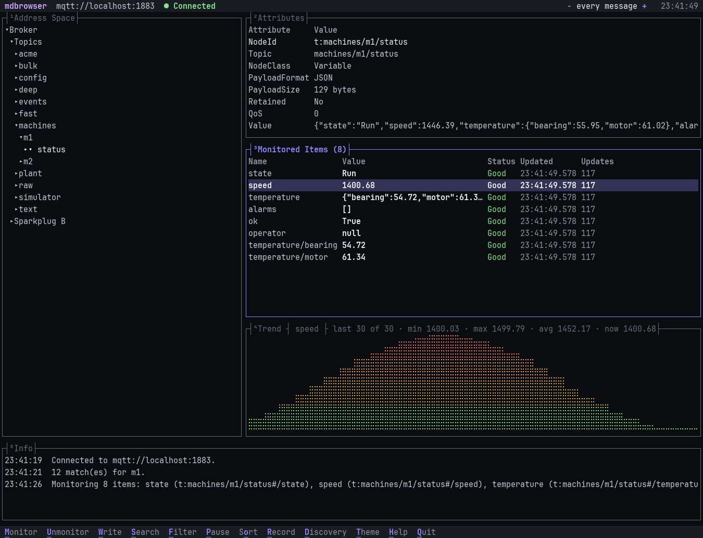

# Command line (`mdbrowser`)

`mdbrowser` does the browsing and monitoring of the app from a terminal or a script: list endpoints, browse the
address space, read and write values, stream live values, and create and run the app's sessions. It speaks the same
protocols as the app: **OPC UA**, **EtherNet/IP (Logix)** and **MQTT** (Sparkplug B, CloudEvents).

## Install

```sh
brew install zaoralj/tap/mdbrowser        # macOS and Linux
```

Or download `mdbrowser-<version>-<os>-<arch>.tar.gz` from the
[releases](https://github.com/ZaoralJ/MachineDataBrowser/releases) and put `mdbrowser` on your `PATH`. It is a single
self-contained file; no .NET installation is needed.

## Commands

Tip: in the app, right-click nodes in the Address Space or rows in Watch ▸ **Copy mdbrowser command** to get a ready
command line for them, with the endpoint and options of the connection.

| Command | Does |
|---|---|
| `mdbrowser endpoints <url>` | the endpoints of an OPC UA server: security mode, policy, logins, certificate thumbprint |
| `mdbrowser browse <url> [node] [--depth N]` | the address space below a node (default: the root) |
| `mdbrowser read <url> <node>... [-R]` | the current value and data type of one or more variables |
| `mdbrowser monitor <url> <node>... [-R]` | live values until Ctrl+C, `--duration` or `--count` |
| `mdbrowser write <url> <node> <value>` | write a value (or several with `--set`); asks first unless `--yes` |
| `mdbrowser session create <file> <url> <node>...` | a session file for the app with these nodes as its watch list |
| `mdbrowser session add <file> <node>...` | adds nodes to a session's watch list; everything else in the file is kept |
| `mdbrowser run <session>` | the watch list of a session file saved by the app (`.mdbsession`), each item at its refresh time |
| `mdbrowser tui <url or session>` | a full-screen browser in the terminal: tree, attributes, live values, trend, write, record; see [below](#full-screen-browser-tui) |
| `mdbrowser mcp --endpoint <url>... --recording <file.db>...` | an MCP server for AI agents (machines and SQLite recordings), read-only; see [MCP server](mcp.md) |

`mdbrowser <command> --help` lists every option.

```sh
mdbrowser endpoints opc.tcp://plc:4840
mdbrowser browse opc.tcp://plc:4840 /Objects/Line1 --depth 2
mdbrowser read eip://10.0.0.5/1,0 "/Controller Tags/Motor.Speed"
mdbrowser monitor mqtt://broker/plant/# /Topics/plant/line1/status/speed --duration 10m
mdbrowser monitor opc.tcp://plc:4840 /Objects/Line1 --recursive --depth 3
mdbrowser run line1.mdbsession --format csv > shift.csv
```

### Nodes

A node is either a **path** of display names from the root, starting with `/`, or an **id**:

- `/Objects/OpcPlc/Telemetry/Basic/StepUp`, `/Controller Tags/Motor.Speed`, `/Topics/plant/line1/status`,
  `"/Sparkplug B/Plant1/Edge1/Press1/Temperature"` (quote paths with spaces);
- `ns=3;s=StepUp` or the portable `nsu=http://…;s=StepUp` (OPC UA), a tag name (Logix), an MQTT id as the app shows it.

`browse` prints full paths, so its output can be passed to `read` and `monitor` as it is.

### Whole folders (`--recursive`)

With `-R` / `--recursive`, `read` and `monitor` expand each folder, object or Logix structure to every variable below
it, like *Monitor folder* in the app:

| Option | |
|---|---|
| `--depth N` | levels below each node (default 10) |
| `--max-items N` | at most this many variables in total (default 500); a note on stderr says when the limit was hit |

- Items are named by their path below the node you passed (`Basic/StepUp`, `Station/Name`), so equal names in
  different folders stay apart.
- A variable you pass directly is read or monitored itself. OPC UA properties of variables (EURange, EngineeringUnits)
  are left out.
- MQTT: a topic with a JSON payload expands to its fields (`status/speed`, `status/temperature/bearing`).
- Nothing found within `--depth` is an error (exit 1).

### Sessions

A session file (`.mdbsession`) is what the app saves with File ▸ Save: the endpoint, its options and the watch list.
The command line reads and writes the same files, so a watch list can go both ways between the app and scripts.

```sh
mdbrowser session create line1.mdbsession opc.tcp://plc:4840 /Objects/Line1 -R -r 1000 --trust-all
mdbrowser session add line1.mdbsession /Objects/Line2/Speed "ns=3;s=Pressure"
mdbrowser monitor opc.tcp://plc:4840 /Objects/Line1/Speed --save quick.mdbsession     # watch now, keep it for later
mdbrowser run line1.mdbsession                                                         # or File ▸ Open in the app
```

- Nodes are saved like the app saves them: portable ids (`nsu=…`, stable across server restarts) with their name and
  path, so Watch can group them by path. `-R`, `--depth` and `--max-items` work as for `read`.
- Options are saved (user name, `--secure`, `--trust-all`, `-r` as the session's default refresh); **never a
  password**. `session add` and `run` take it from `--password` or `MDBROWSER_PASSWORD`.
- `session create` and `--save` don't overwrite an existing file without `--force`. `session add` connects with the
  file's endpoint, skips nodes already in the watch list and keeps everything else (bookmarks, columns, display
  formats, monitoring settings).
- Nodes given by id are checked with the device first; one that doesn't exist is an error and nothing is written.

### Recording to a file

`monitor` and `run` record every sample with `--record <file>`, alongside what they show:

```sh
mdbrowser monitor opc.tcp://plc:4840 /Objects/Line1 -R -r 500 --record line1.db       # SQLite
mdbrowser run line1.mdbsession --duration 8h --record shift.db
mdbrowser monitor opc.tcp://plc:4840 /Objects/Line1/Speed --record speed.csv            # CSV
```

`--retention 30d` (SQLite only) deletes samples older than that from the file while recording, so an always-on
recording doesn't grow without end:

```sh
mdbrowser run plant.mdbsession --record plant.db --retention 30d
```

It is the same file the app writes with *Also write to file*: SQLite for `.db` / `.sqlite` (one more recording in the
file each time, queryable with SQL; see [Recording to SQLite](user-manual.md#recording-to-sqlite)), CSV otherwise. The
app's recording viewer opens either. The file is the store, so a recording can run for days without growing memory.

### Writing values

```sh
mdbrowser write opc.tcp://plc:4840 /Objects/Line1/Setpoint 42.5
mdbrowser write eip://10.0.0.5/1,0 Program:Main.Recipe "[1, 2, 3]"
mdbrowser write opc.tcp://plc:4840 --set /Objects/Line1/Mode=AUTO --set /Objects/Line1/Setpoint=42.5 --yes
```

- The value is text, converted to the variable's data type like *Write value…* in the app: numbers, `true`/`false`,
  text; arrays comma-separated, optionally in brackets. What each protocol writes is described in the
  [user manual](user-manual.md#writing-values).
- **It asks first.** In a terminal, `write` shows the current and new values and asks for confirmation (default *no*).
  `--yes` skips the question; without a terminal (a script, a pipe) and without `--yes` it refuses rather than guess.
- After writing it reads the values back and prints *before*, *after* and the result per item, so a write the device
  accepted but didn't apply is visible. MQTT values come back through the broker; `write` waits up to 2 s for them.
- `--set node=value` writes several in one go. Paths split at the first `=` (values may contain `=`), ids at the last
  (`--set "ns=3;s=Mode=AUTO"`); for a value with `=` on an id, use `write <url> <id> <value>`.
- Exit code 1 when any value was not written; the reason is in the *result* column (`-f json`: `written`, `error`).

### Full-screen browser (`tui`)

`mdbrowser tui` is the app in a terminal, for every protocol: over SSH, on a headless box next to the line, or
when a window is one too many.

```sh
mdbrowser tui opc.tcp://plc:4840
mdbrowser tui eip://10.0.0.5/1,0
mdbrowser tui mqtt://broker:1883
mdbrowser tui line1.mdbsession          # the session's endpoint, options and watch list, monitored at once
```



Five panes: **¹** address space, **²** attributes of the selected node, **³** monitored items, **⁴** a trend
chart of the selected (numeric) item, **⁵** an info log. The header shows the endpoint and its state, the
refresh time and, while recording, the file and sample count. Every action is a key; the bar at the bottom shows
the main ones and `h` lists them all. Drag the border between two panes with the mouse to resize them; a
double-click on it restores the default size. The sizes are remembered per endpoint URL (in `tui-layouts.json`
in the data folder, not in the session file); `0` resets the layout.

| Key | Does |
|---|---|
| `Tab` / `Shift+Tab`, `→` / `←` / `Enter` | move between panes; expand and collapse nodes |
| `1` … `5` / `Shift+1` … `5` | show or hide a pane / the pane alone on the full screen (again restores the layout) |
| `0` | reset the layout: every pane shown, default sizes, the endpoint's saved sizes forgotten |
| `m` / `u` | monitor the variable, or every variable below a folder or structure / stop monitoring it |
| `w` | write a value: shows the current one, asks first, reads it back |
| `s` | search the address space by name or id (`Temp*`, `Motor?`) and go to a match |
| `f` / `o` `O` / `i` / `p` | filter the monitored items / sort by a column, reverse / show the NodeId column / pause the display |
| `-` / `+` | refresh time of all monitored items |
| `x` / `[` `]` | reset the trend / fewer or more samples in it (fit the width, 30 at first, 60, 120, 300, 600) |
| `r` | start or stop recording the monitored items: SQLite for `.db`, CSV otherwise (like `--record`) |
| `Ctrl+S` | save the monitored items as a session file; an existing one keeps everything else |
| `Ctrl+O` | open a session (the app's recent ones, those in this folder, or any file): its endpoint, options and watch list, in place |
| `y` / `a` / `e` | OPC UA: history of the variable / current alarms / live events |
| `d` | MQTT: pause discovery, receiving only the monitored topics (like *Pause discovery* in the app) |
| `g` / `t` / `l` | connection diagnostics / next colour theme / light or dark |
| `q` | quit |

- **Colours** are the app's themes, the one chosen in the app by default; `--theme Nord` and `--light` pick another
  for this run, `t` and `l` switch while running. Status is green, amber or red; stale values are dimmed.
- **Writes** follow the session: a read-only session never writes. Names keep their underscores (`Bulk_0014`).
- The display can pause (`p`) while monitoring and any recording go on; `-`/`+` change the rate at the device.
- Dialogs take their buttons' letters (`c` Close, `g` Go to, `y` / `n`); file prompts complete paths with `Tab`.
- It needs an interactive terminal; scripts use `browse`, `read` and `monitor`.

### Connection options

| Option | |
|---|---|
| `-u, --user` / `-p, --password` | login (OPC UA, MQTT); the password can also come from `MDBROWSER_PASSWORD` |
| `--secure` | OPC UA: the most secure endpoint the server offers |
| `--trust-all` | accept untrusted server certificates; for lab networks only |

`mdbrowser` shares the app's data folder: certificates trusted in the app are trusted here, and the OPC UA client
identity is the same, so a server that trusts the app trusts the command line too. `run` takes the endpoint, login
name and options from the session; passwords are never saved, so pass `--password` or set `MDBROWSER_PASSWORD`.

### Output

| `--format` | In a terminal | Redirected (pipe, file) |
|---|---|---|
| `text` (default) | tables, a tree for `browse`, a live table for `monitor`/`run` that updates in place, coloured status | aligned plain text, one line per update |
| `json` | `read`/`browse`/`endpoints`: a JSON array; `monitor`/`run`: one JSON object per line, values keep their type | same |
| `csv` | a header line, then rows | same |

The live table starts with the current values, read when monitoring starts; *Updates* then counts the changes that
arrived (the device's first notification that only repeats the starting value isn't counted). Redirected output and
JSON/CSV stream only the notifications.

Text and CSV show names only; add `--ids` (`read`, `write`, `monitor`, `run`) for an id column next to the name.
When two items have the same name, ids are shown anyway. JSON always includes `id`, and `monitor`/`run` CSV too.

```sh
mdbrowser read opc.tcp://plc:4840 /Objects/Line1/Speed -f json | jq '.[0].value'
mdbrowser monitor opc.tcp://plc:4840 /Objects/Line1/Speed -f json | jq -c 'select(.status != "Good")'
```

### Stopping and exit codes

`monitor` and `run` stop on Ctrl+C (or SIGTERM), after `--duration` (`30s`, `5m`, `8h`, `1d`, `500ms` or `hh:mm:ss`) or
after `--count` updates, and close the connection properly.

| Exit code | |
|---|---|
| `0` | success, or a stream that ended normally |
| `1` | an error (one line on stderr, `mdbrowser: …`), or a `read` where a value could not be read |
| `130` | cancelled before the command finished (e.g. Ctrl+C during `read`) |

Items that can't be monitored are reported on stderr and the rest continue.
